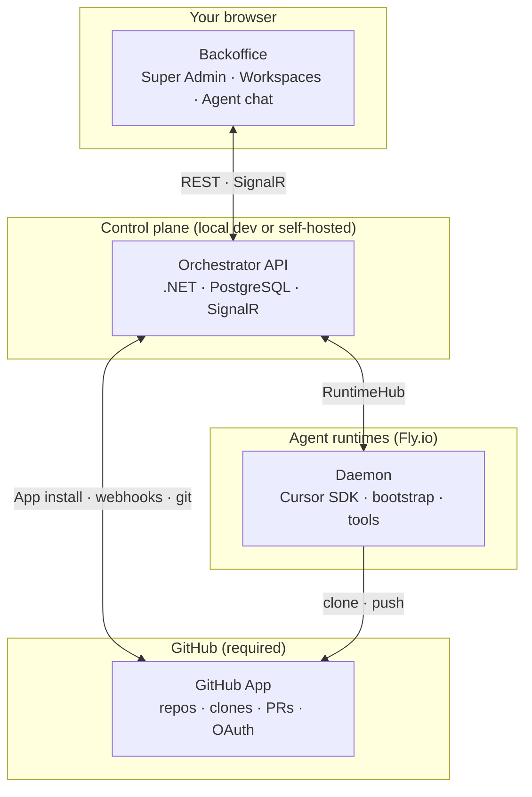

# GlennCode Factory

Open-source software factory with a spec-driven agent workflow, workspace UI, and Fly.io agent runtimes powered by the Cursor SDK.

**Stack:** .NET 9 · React 19 · PostgreSQL 16 · SignalR · Hangfire · Orval-generated API client

---

## What you get

| Layer | What it does |
|-------|----------------|
| **Orchestrator API** (`packages/dotnet-api`) | Auth, projects, workspaces, kanban, specs, runtime provisioning, SignalR hubs |
| **Backoffice UI** (`packages/backoffice-web`) | Super Admin console + per-workspace project UI |
| **Agent daemon** (`packages/daemon`) | Runs on Fly machines; connects to the API via SignalR, executes agent turns with the **Cursor SDK**, applies runtime specs 

Use it as:

- A **local dev template** — API + React + Postgres on your laptop (login, Super Admin UI)
- A **self-hosted control plane** — single Docker service + managed Postgres ([`render.yaml`](render.yaml))
- An **agent platform** — **GitHub App** + Fly.io runtimes + daemon bundle (required for projects and agent chat; there is no non-GitHub project path)

---

## System architecture



**Backoffice** is the React UI in your browser — admin console, workspaces, projects, kanban, specs, and agent chat.

**Orchestrator API** is the control plane: auth, projects, runtime provisioning, and real-time hubs.

**GitHub** is not optional. Every project is backed by a GitHub repository (connect an existing repo, create a new one, or generate from a starter template — all via the GitHub App). The daemon clones and pushes through GitHub; there is no alternate VCS or repo-less mode.

**Agent runtimes** are Fly.io machines. Each project gets one. The **daemon** connects to the API over SignalR and runs agent turns via the **Cursor SDK** (`@cursor/sdk`).

Creating a project provisions a runtime. Agent chat requires that runtime to be online and the daemon connected.

---

## Prerequisites

| Tool | Version | Notes |
|------|---------|-------|
| [.NET SDK](https://dotnet.microsoft.com/download) | 9.x | Backend |
| [Node.js](https://nodejs.org/) | 20+ | Frontend + root scripts |
| [Docker Desktop](https://www.docker.com/products/docker-desktop) | — | Local Postgres only |
| [cloudflared](https://developers.cloudflare.com/cloudflare-one/connections/connect-networks/downloads/) | — | Auto-installed via Homebrew on macOS by `npm run dev` |

For the **agent platform** (projects + agent chat) you also need:

- A **GitHub App** (org or user) — register credentials in System Settings; install the app on repos/orgs
- **Fly.io** account + published daemon bundle + active runtime base image
- **Cloudflare** credentials for the preview-tunnel subdomain pool
- Per-project **`CURSOR_API_KEY`** (BYOK)

See [How to set up end-to-end](#how-to-set-up-end-to-end).

---

## How to set up end-to-end

Two paths — pick one:

| Path | When |
|------|------|
| **[A — From scratch](#path-a--from-scratch)** | Greenfield install; you configure System Settings yourself |
| **[B — Environment backup](#path-b--environment-backup)** | Clone or restore an existing environment from a JSON export |

Both paths share the same **local dev** and **publish** steps at the end. Agents should read the linked **skills** before changing runtime/daemon code or guessing publish order.

### Shared: local control plane

```bash
cp .env.example .env          # fill required keys (see below)
npm run setup                 # Postgres + restore + migrations
npm run dev                   # API + frontend + Cloudflare quick tunnel
```

`npm run dev` (via [`scripts/dev.sh`](scripts/dev.sh)) does everything needed locally:

1. Starts Docker Postgres
2. Reuses a **persistent Cloudflare quick tunnel** to `localhost:5338` when one is already running, otherwise starts one (installs `cloudflared` via Homebrew on macOS if missing). The tunnel **keeps running** when you quit `npm run dev` — same Fly URL across dev restarts.
3. Sets **`Runtime__PublicApiUrl`** for the API process — overrides System Settings and `.env` so Fly runtimes can dial back
4. Runs API (watch) + frontend

Watch the startup banner for the **Fly URL** (`https://….trycloudflare.com`). **Respawn** existing runtimes only when that URL changes (`npm run dev:tunnel:stop` forces a new URL).

| URL | Purpose |
|-----|---------|
| http://localhost:5173 | Browser UI (Vite proxies `/api` + `/hubs`) |
| http://localhost:5338 | Local API / Swagger |
| Banner **Fly URL** | What Fly machines use as `MAIN_API_URL` |

Log in: OTP appears in the **API terminal** when `Email__Provider=Console`. Use the email from `Bootstrap__SuperAdminEmail`.

**Escape hatch:** `npm run dev:plain` — no tunnel (browser-only; Fly runtimes won't reach you). Stop the persistent tunnel: `npm run dev:tunnel:stop`.

#### Required `.env` keys (every path)

| Variable | Generate / set |
|----------|----------------|
| `SystemSettings__EncryptionKey` | `openssl rand -base64 32` — **back up in production** |
| `Jwt__Key` | `openssl rand -base64 48` |
| `Bootstrap__SuperAdminEmail` | Your SuperAdmin login email |

Full reference: [`.env.example`](.env.example)

---

### Path A — From scratch

After [shared local setup](#shared-local-control-plane), log in as SuperAdmin and configure **Super Admin → System Settings** (`/super-admin/system-settings`).

#### System Settings checklist (agent platform)

| Category | Keys | Required for |
|----------|------|--------------|
| **GitHub** | `AppId`, `ClientId`, `ClientSecret`, `PrivateKeyPem`, `WebhookSecret`, `AppSlug`, `OAuthRedirectUri`, `AppInstallRedirectUri` | **All projects** — OAuth login, app install, repo clone/push, webhooks. No GitHub App → no projects. |
| **Fly** | `Fly:ApiToken`, `Fly:OrgSlug`, `Fly:AppName`, `Fly:DefaultRegion` | Provisioning Fly machines + volumes |
| **Runtime** | `Runtime:PublicApiUrl` | Stamped as `MAIN_API_URL` on machines — **overridden by `npm run dev` tunnel** locally; set a stable public URL in production |
| **RuntimeTokens** | `SigningKeyCurrent` | Auto-generated on first boot if empty |
| **Cloudflare** | `ApiToken`, `AccountId`, `ZoneId`, `BaseDomain` | Preview tunnel pool (per-branch subdomains) |
| **File storage** | R2 creds in `.env` or use `Local` for dev | Daemon bundle upload on publish |

#### GitHub App (required)

Create a GitHub App under your org (or user), then paste every field into **Super Admin → System Settings → GitHub**. Redirect URIs must match your API base URL (defaults in the catalog point at `http://localhost:5338/...` for local dev).

After System Settings are saved:

1. **Install the app** on the org/repos you will use (workspace UI prompts this on first project)
2. Grant the app access to the repositories the agent will work in

Every new-project flow goes through GitHub — pick an existing repo, create a blank repo on GitHub, paste a `github.com/…` URL, or start from a **Starter** (generates a repo from a GitHub template). There is no path that skips GitHub.

`RuntimeTokens:SigningKeyCurrent` and catalog rows are seeded on first boot from `.env` / `appsettings.json` where present; after that the DB is authoritative (except `Runtime__PublicApiUrl` env override).

#### Publish daemon + runtime image (once per environment)

Run with **`npm run dev` already up** (scripts default to `http://localhost:5338` and mint a SuperAdmin JWT from `.env`).

| Step | Script | Skill |
|------|--------|-------|
| 1. Daemon bundle | `./scripts/publish-daemon.sh` | [daemon-deploy](.claude/skills/daemon-deploy/SKILL.md) |
| 2. Runtime base image | `./scripts/publish-runtime-image-remote.sh` | [runtime-deployment](.claude/skills/runtime-deployment/SKILL.md) |
| 2 alt (local Docker) | `./scripts/publish-runtime-image.sh` | same |

**Publish notes:**

- `publish-daemon.sh` — builds esbuild bundle, uploads to storage, registers `DaemonVersions` (channel `stable`)
- `publish-runtime-image-remote.sh` — Fly remote build of [`Dockerfile.runtime-base`](Dockerfile.runtime-base), registers + activates `RuntimeImages`
- Override Fly app/registry if yours differ from defaults: `APP=… IMAGE_NAME=… REGISTRY=registry.fly.io/… ./scripts/publish-runtime-image-remote.sh`
- After SignalR hub contract changes: `./scripts/generate-signalr.sh` then republish daemon — see [daemon-deploy](.claude/skills/daemon-deploy/SKILL.md)

Verify:

```bash
curl -fsS http://localhost:5338/api/daemon-versions/resolve?channel=stable
# Super Admin → Runtime Images — one row Active
```

#### Preview tunnel pool

**Super Admin → Subdomains** (`/super-admin/subdomains`) — batch-create Cloudflare preview tunnels. Project creation assigns one per branch; empty pool → `pool_empty` error with link to this page.

#### Create a project and smoke-test

1. Create a workspace, install the GitHub App, then create a project (existing repo, new repo, GitHub URL, or Starter — all GitHub-backed)
2. Wait for runtime: `Pending → Booting → Bootstrapping → Online` (~90 s) — **Super Admin → Runtime Monitor**
3. Open project chat; submit a prompt

Stuck runtimes → [runtime-debug](.claude/skills/runtime-debug/SKILL.md). Architecture map → [runtime-environment](.claude/skills/runtime-environment/SKILL.md).

---

### Path B — Environment backup

Use when cloning config, workspaces, projects, specs, and secrets from another deployment.

**Super Admin → Environment Backup** (`/super-admin/environment-backup`) on the **source** env → Export JSON.

On the **target** machine:

1. [Shared local setup](#shared-local-control-plane) with a **fresh** `.env` (`SystemSettings__EncryptionKey`, `Jwt__Key`, `Bootstrap__SuperAdminEmail`)
2. `npm run dev` → log in as SuperAdmin
3. **Import** the JSON blob on Environment Backup

Import restores (clear-text secrets re-encrypted under the **target** encryption key): System Settings (incl. GitHub App credentials), users, workspaces, GitHub installations, projects, branches, secrets, specs, kanban.

The **GitHub App must still exist on github.com** with matching webhook/OAuth URLs for the target environment. Re-authorize installations if redirect URLs changed.

**Not included in the backup** — you must still do these on the target:

| Missing from backup | Action |
|---------------------|--------|
| **DaemonVersions** | `./scripts/publish-daemon.sh` |
| **RuntimeImages** | `./scripts/publish-runtime-image-remote.sh` |
| **Subdomain pool** | Super Admin → Subdomains → batch create |
| **Fly machines / runtimes** | Re-provisioned when you create projects or respawn |
| **Conversations / agent history** | Not restored |

After import, run the [publish steps](#publish-daemon--runtime-image-once-per-environment) and [subdomain pool](#preview-tunnel-pool). `npm run dev` sets `Runtime__PublicApiUrl` via tunnel automatically; respawn any imported runtimes stuck on an old URL.

---

### Scripts reference

| Script | Purpose |
|--------|---------|
| [`scripts/dev.sh`](scripts/dev.sh) | Default dev stack (tunnel + API + web) — invoked by `npm run dev` |
| [`scripts/publish-daemon.sh`](scripts/publish-daemon.sh) | Build, upload, register daemon bundle |
| [`scripts/publish-runtime-image-remote.sh`](scripts/publish-runtime-image-remote.sh) | Remote-build runtime base image (no local Docker) |
| [`scripts/publish-runtime-image.sh`](scripts/publish-runtime-image.sh) | Local Docker build + push runtime image |
| [`scripts/generate-swagger.sh`](scripts/generate-swagger.sh) | Regenerate Orval client after API changes |
| [`scripts/generate-signalr.sh`](scripts/generate-signalr.sh) | Regenerate SignalR TS client after hub contract changes |
| [`scripts/lib/platform-auth.mjs`](scripts/lib/platform-auth.mjs) | Mint SuperAdmin JWT + decrypt Fly token from DB (used by publish scripts) |

---

### Skills reference (agents & operators)

| Skill | Read when |
|-------|-----------|
| [runtime-environment](.claude/skills/runtime-environment/SKILL.md) | Architecture, bootstrap, specs, persistence |
| [runtime-deployment](.claude/skills/runtime-deployment/SKILL.md) | Publish runtime image, provision, smoke-test |
| [daemon-deploy](.claude/skills/daemon-deploy/SKILL.md) | Publish daemon; SignalR contract changed |
| [runtime-debug](.claude/skills/runtime-debug/SKILL.md) | SSH, logs, stuck Bootstrapping/Online |
| [self-healing-runtime](.claude/skills/self-healing-runtime/SKILL.md) | Degraded boot, spec repair loop |

---

## First-time onboarding

> **Full agent-platform setup** (Fly, publish, subdomains, smoke-test): see [How to set up end-to-end](#how-to-set-up-end-to-end).

### 1. Clone and install

```bash
git clone <your-repo-url>
cd agent-template   # or your fork name
```

### 2. Environment file

```bash
cp .env.example .env
```

Edit `.env` and set **required** values before the API will boot:

| Variable | How to generate / what to set |
|----------|-------------------------------|
| `SystemSettings__EncryptionKey` | `openssl rand -base64 32` — **back up in production**; losing it makes DB-encrypted secrets unrecoverable |
| `Jwt__Key` | `openssl rand -base64 48` (min 32 chars) |
| `Bootstrap__SuperAdminEmail` | Email for the auto-seeded SuperAdmin (e.g. `you@example.com`) |

Everything else in `.env.example` has sensible local defaults (Console email, local file storage, Postgres on port 43594).

### 3. Bootstrap the stack

```bash
npm run setup
```

This will:

1. Start PostgreSQL in Docker (`packages/local-db`, port **43594**)
2. `dotnet restore` the API
3. `npm install` the frontend
4. Apply EF Core migrations

### 4. Run

```bash
npm run dev
```

See [Shared: local control plane](#shared-local-control-plane) for what this starts (tunnel, URLs, Fly URL banner).

| Service | URL |
|---------|-----|
| Frontend | http://localhost:5173 |
| API | http://localhost:5338 |
| Swagger | http://localhost:5338/swagger |
| Fly daemons | Quick-tunnel URL printed in the startup banner |

### 5. Log in

1. Open http://localhost:5173
2. Enter the email from `Bootstrap__SuperAdminEmail`
3. Request OTP — with `Email__Provider=Console`, the code is printed in the **API terminal** (not sent by email)
4. Verify OTP → you receive a JWT and land as SuperAdmin

The API seeds the bootstrap SuperAdmin on every startup when `Bootstrap__SuperAdminEmail` is set. You can also run `npm run create-admin` to register an additional admin via the API.

---

## Project structure

```
.
├── packages/
│   ├── dotnet-api/           # .NET 9 Web API (vertical slices + CQRS)
│   │   └── Source/Features/  # One folder per feature
│   ├── backoffice-web/       # React 19 + MUI frontend
│   │   └── src/applications/ # super-admin · workspace
│   ├── daemon/               # Agent runtime (Cursor SDK, SignalR, bootstrap, tools)
│   └── local-db/             # Docker Compose for Postgres
├── .claude/skills/           # Agent skills (Orval, SignalR, runtime deploy, …)
├── scripts/                  # setup, swagger gen, daemon publish, migrations
├── Dockerfile                # Production API + bundled frontend
├── Dockerfile.runtime-base   # Fly agent runtime machine image
├── render.yaml               # Render.com blueprint (self-host)
├── .env.example              # All env vars documented
└── CLAUDE.md                 # Instructions for AI coding agents
```

Backend conventions: [`packages/dotnet-api/CLAUDE.md`](packages/dotnet-api/CLAUDE.md)

---

## Frontend applications

| App | Route prefix | Who | Purpose |
|-----|--------------|-----|---------|
| **Workspace** | `/w/:slug/...` | Workspace members | Projects, chat, kanban, specs |
| **Super Admin** | `/super-admin/...` | SuperAdmin | Runtimes, GitHub, system settings, templates |

API types and React Query hooks are **auto-generated** — never edit `packages/backoffice-web/src/api/` by hand.

```bash
npm run generate-swagger   # after backend API changes
```

---

## Development commands

```bash
# Full stack (tunnel + API + frontend — use this)
npm run dev
npm run dev:plain         # no tunnel; browser-only local dev

npm run dev:api           # API only
npm run dev:web           # frontend only

# Publish (API must be running; see How to set up end-to-end)
./scripts/publish-daemon.sh
./scripts/publish-runtime-image-remote.sh

# Database
npm run db:up | db:down | db:logs | db:restart

# API
npm run api:build
npm run migration:add <Name>
npm run migration:update

# Frontend
cd packages/backoffice-web && npm run typecheck
cd packages/backoffice-web && npm run build

# Codegen
npm run generate-swagger
npm run generate-signalr   # after SignalR hub contract changes
```

---

## Configuration reference

All secrets and integration toggles live in environment variables. ASP.NET maps `Section__Key` in `.env` to `Section:Key` in config.

| Concern | Local default | Production |
|---------|---------------|------------|
| Database | Docker Postgres :43594 | `DATABASE_URL` from host |
| Email / OTP | `Console` (OTP in API logs) | `Resend` + API token |
| **GitHub** | GitHub App in System Settings (required for projects) | same — no projects without it |
| File storage | `Local` → `uploads/` | Cloudflare R2 |
| Agent chat | workspace or per-project `CURSOR_API_KEY` in credentials (project overrides workspace when allowed) | same (BYOK via Cursor SDK on the daemon) |
| Agent runtimes | `npm run dev` sets tunnel URL automatically | Fly.io + published daemon/image + subdomain pool |

Full list: [`.env.example`](.env.example) · committed [`appsettings.json`](packages/dotnet-api/appsettings.json) has empty placeholders only.

---

## Self-hosting (Render)

[`render.yaml`](render.yaml) provisions:

- Managed PostgreSQL 16
- Single Docker web service (API + built frontend)

After blueprint deploy, set secret env vars in the Render dashboard (`SystemSettings__EncryptionKey`, `Jwt__Key`, `Bootstrap__SuperAdminEmail`, etc.).

**GitHub Actions (auto-publish on `main`):** set `CiPublish__ApiKey` on Render (`openssl rand -base64 48`), then add GitHub secrets `CONTROL_PLANE_API` (your Render URL) and `CONTROL_PLANE_PUBLISH_API_KEY` (same value). CI talks to the API only — no Postgres access. Fly registry login uses `GET /api/ci/registry-credentials` (reads `Fly:ApiToken` from System Settings server-side).

**Note:** SignalR uses an in-memory backplane — run **one instance** unless you add Redis.

This deploys the **control plane** only. Projects and agent chat still require a **GitHub App**, Fly.io runtimes, and a published daemon bundle (see [How to set up end-to-end](#how-to-set-up-end-to-end)).

---

## Agent runtimes

Projects and agent chat require a **GitHub-backed repo**, Fly.io runtimes running the daemon, and a GitHub App configured in System Settings. The control plane (API + Backoffice) can run locally or on Render; runtimes always run on Fly.

**Local dev:** `npm run dev` exposes the API via a Cloudflare quick tunnel and sets `Runtime__PublicApiUrl` automatically.

**Production:** set a stable `Runtime:PublicApiUrl` in System Settings (named tunnel or public hostname — not ephemeral quick tunnels).

End-to-end checklist: [How to set up end-to-end](#how-to-set-up-end-to-end). Do not guess publish order — use the skills:

| Skill | When |
|-------|------|
| [`runtime-environment`](.claude/skills/runtime-environment/SKILL.md) | Architecture, bootstrap, specs, persistence |
| [`daemon-deploy`](.claude/skills/daemon-deploy/SKILL.md) | SignalR contract / daemon code changed |
| [`runtime-deployment`](.claude/skills/runtime-deployment/SKILL.md) | Base image, provisioning, smoke tests |
| [`runtime-debug`](.claude/skills/runtime-debug/SKILL.md) | SSH, logs, hot-swap |
| [`self-healing-runtime`](.claude/skills/self-healing-runtime/SKILL.md) | Degraded boot + repair loop |

---

## Real-time (SignalR)

| Hub | Path | Purpose |
|-----|------|---------|
| **AgentHub** | `/hubs/agent` | Turn lifecycle, chat streaming |
| **RuntimeHub** | `/hubs/runtime` | Daemon ↔ API (bootstrap, heartbeats, spec deltas) |
| **PlanningHub** | `/hubs/planning` | Live specs + kanban updates |

---

## For AI coding agents

See [`CLAUDE.md`](CLAUDE.md) for build conventions, subagent delegation, Orval patterns, and the skills index.

On a managed platform, spec + kanban workflow is injected via `packages/daemon/src/harness/`.

---

## Troubleshooting

**API won't start — encryption key**

Set `SystemSettings__EncryptionKey` in `.env` (see onboarding step 2).

**Database connection failed**

```bash
docker ps                  # postgres container running?
npm run db:logs
```

**Port in use**

```bash
lsof -i :5338
lsof -i :5173
```

**Type errors after backend changes**

```bash
npm run generate-swagger
```

**OTP never arrives**

Check the API console — local dev uses `Email__Provider=Console`.

**Fly runtime can't reach API**

Ensure you're on `npm run dev` (not `dev:plain`). Check the banner **Fly URL**. Respawn runtimes after the tunnel URL changes.

**`pool_empty` when creating a project**

Create preview tunnels: Super Admin → Subdomains → batch create.

**No active runtime image / daemon**

Run `./scripts/publish-daemon.sh` and `./scripts/publish-runtime-image-remote.sh` — see [How to set up end-to-end](#how-to-set-up-end-to-end).

**Can't create a project / no repos listed**

Configure the **GitHub App** in System Settings and install it on your org. GitHub is required for all projects — see [GitHub App (required)](#github-app-required).

---

## License

[MIT](LICENSE)
