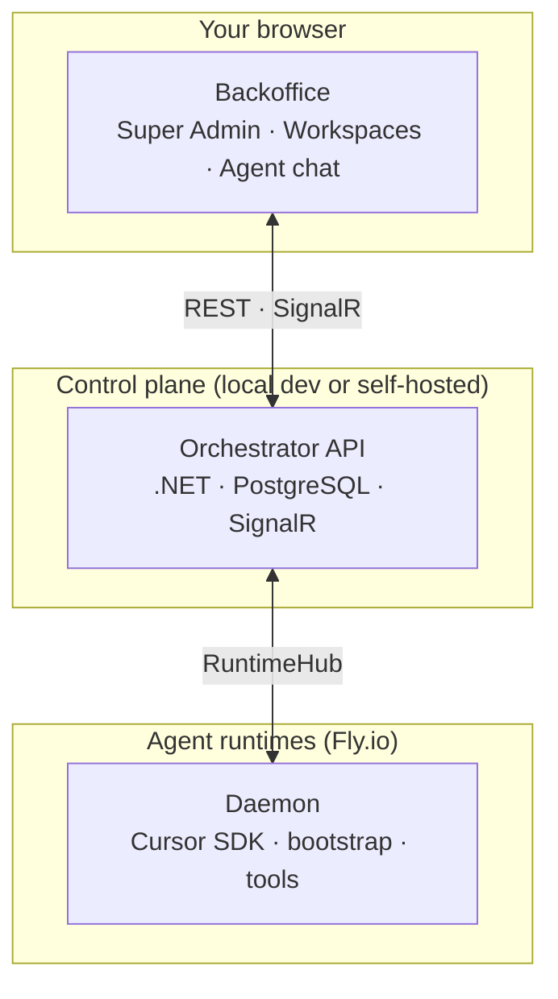

# Agent Template

Open-source full-stack template for building AI-powered business applications with a spec-driven agent workflow, workspace UI, and Fly.io agent runtimes powered by the Cursor SDK.

**Stack:** .NET 9 · React 19 · PostgreSQL 16 · SignalR · Hangfire · Orval-generated API client

---

## What you get

| Layer | What it does |
|-------|----------------|
| **Orchestrator API** (`packages/dotnet-api`) | Auth, projects, workspaces, kanban, specs, runtime provisioning, SignalR hubs |
| **Backoffice UI** (`packages/backoffice-web`) | Super Admin console + per-workspace project UI |
| **Agent daemon** (`packages/daemon`) | Runs on Fly machines; connects to the API via SignalR, executes agent turns with the **Cursor SDK**, applies runtime specs |
| **Local Postgres** (`packages/local-db`) | Docker database for development |

Use it as:

- A **local dev template** — API + React + Postgres on your laptop (login, admin, UI work)
- A **self-hosted control plane** — single Docker service + managed Postgres ([`render.yaml`](render.yaml))
- An **agent platform** — Fly.io runtimes + daemon bundle + `Runtime__PublicApiUrl` (required for projects and agent chat)

---

## System architecture



**Backoffice** is the React UI in your browser — admin console, workspaces, projects, kanban, specs, and agent chat.

**Orchestrator API** is the control plane: auth, projects, runtime provisioning, and real-time hubs.

**Agent runtimes** are Fly.io machines. Each project gets one. The **daemon** connects to the API over SignalR and runs agent turns via the **Cursor SDK** (`@cursor/sdk`).

Creating a project provisions a runtime. Agent chat requires that runtime to be online and the daemon connected.

---

## Prerequisites

| Tool | Version | Notes |
|------|---------|-------|
| [.NET SDK](https://dotnet.microsoft.com/download) | 9.x | Backend |
| [Node.js](https://nodejs.org/) | 20+ | Frontend + root scripts |
| [Docker Desktop](https://www.docker.com/products/docker-desktop) | — | Local Postgres only |

For agent runtimes you also need: Fly.io account, `Runtime__PublicApiUrl` (API reachable from Fly), daemon bundle, and a `CURSOR_API_KEY`. See [`.env.example`](.env.example) for the full list (R2, Resend, OpenRouter, etc.).

---

## First-time onboarding

### 1. Clone and install

```bash
git clone <your-repo-url>
cd agent-template   # or your fork name
```

### 2. Environment file

```bash
cp .env.example .env
```

Edit `.env` and set **required** values before the API will boot:

| Variable | How to generate / what to set |
|----------|-------------------------------|
| `SystemSettings__EncryptionKey` | `openssl rand -base64 32` — **back up in production**; losing it makes DB-encrypted secrets unrecoverable |
| `Jwt__Key` | `openssl rand -base64 48` (min 32 chars) |
| `Bootstrap__SuperAdminEmail` | Email for the auto-seeded SuperAdmin (e.g. `you@example.com`) |

Everything else in `.env.example` has sensible local defaults (Console email, local file storage, Postgres on port 43594).

### 3. Bootstrap the stack

```bash
npm run setup
```

This will:

1. Start PostgreSQL in Docker (`packages/local-db`, port **43594**)
2. `dotnet restore` the API
3. `npm install` the frontend
4. Apply EF Core migrations

### 4. Run

```bash
npm run dev
```

| Service | URL |
|---------|-----|
| Frontend | http://localhost:5173 |
| API | http://localhost:5338 |
| Swagger | http://localhost:5338/swagger |

### 5. Log in

1. Open http://localhost:5173
2. Enter the email from `Bootstrap__SuperAdminEmail`
3. Request OTP — with `Email__Provider=Console`, the code is printed in the **API terminal** (not sent by email)
4. Verify OTP → you receive a JWT and land as SuperAdmin

The API seeds the bootstrap SuperAdmin on every startup when `Bootstrap__SuperAdminEmail` is set. You can also run `npm run create-admin` to register an additional admin via the API.

---

## Project structure

```
.
├── packages/
│   ├── dotnet-api/           # .NET 9 Web API (vertical slices + CQRS)
│   │   └── Source/Features/  # One folder per feature
│   ├── backoffice-web/       # React 19 + MUI frontend
│   │   └── src/applications/ # super-admin · workspace
│   ├── daemon/               # Agent runtime (Cursor SDK, SignalR, bootstrap, tools)
│   └── local-db/             # Docker Compose for Postgres
├── .claude/skills/           # Agent skills (Orval, SignalR, runtime deploy, …)
├── scripts/                  # setup, swagger gen, daemon publish, migrations
├── Dockerfile                # Production API + bundled frontend
├── Dockerfile.runtime-base   # Fly agent runtime machine image
├── render.yaml               # Render.com blueprint (self-host)
├── .env.example              # All env vars documented
└── CLAUDE.md                 # Instructions for AI coding agents
```

Backend conventions: [`packages/dotnet-api/CLAUDE.md`](packages/dotnet-api/CLAUDE.md)

---

## Frontend applications

| App | Route prefix | Who | Purpose |
|-----|--------------|-----|---------|
| **Workspace** | `/w/:slug/...` | Workspace members | Projects, chat, kanban, specs |
| **Super Admin** | `/super-admin/...` | SuperAdmin | Runtimes, GitHub, system settings, templates |

API types and React Query hooks are **auto-generated** — never edit `packages/backoffice-web/src/api/` by hand.

```bash
npm run generate-swagger   # after backend API changes
```

---

## Development commands

```bash
# Full stack
npm run dev              # API (watch) + frontend
npm run dev:api          # API only
npm run dev:web          # frontend only

# Database
npm run db:up | db:down | db:logs | db:restart

# API
npm run api:build
npm run migration:add <Name>
npm run migration:update

# Frontend
cd packages/backoffice-web && npm run typecheck
cd packages/backoffice-web && npm run build

# Codegen
npm run generate-swagger
npm run generate-signalr   # after SignalR hub contract changes
```

---

## Configuration reference

All secrets and integration toggles live in environment variables. ASP.NET maps `Section__Key` in `.env` to `Section:Key` in config.

| Concern | Local default | Production |
|---------|---------------|------------|
| Database | Docker Postgres :43594 | `DATABASE_URL` from host |
| Email / OTP | `Console` (OTP in API logs) | `Resend` + API token |
| File storage | `Local` → `uploads/` | Cloudflare R2 |
| AI chat | optional `OpenRouter__ApiKey` | same |
| Agent runtimes | not configured locally | Fly.io + `Runtime__PublicApiUrl` + daemon bundle + `CURSOR_API_KEY` |

Full list: [`.env.example`](.env.example) · committed [`appsettings.json`](packages/dotnet-api/appsettings.json) has empty placeholders only.

---

## Self-hosting (Render)

[`render.yaml`](render.yaml) provisions:

- Managed PostgreSQL 16
- Single Docker web service (API + built frontend)

After blueprint deploy, set secret env vars in the Render dashboard (`SystemSettings__EncryptionKey`, `Jwt__Key`, `Bootstrap__SuperAdminEmail`, etc.).

**Note:** SignalR uses an in-memory backplane — run **one instance** unless you add Redis.

This deploys the **control plane** only. Projects and agent chat still require Fly.io runtimes and a published daemon bundle (see [Agent runtimes](#agent-runtimes)).

---

## Agent runtimes

Projects and agent chat require Fly.io runtimes running the daemon. The control plane (API + Backoffice) can run locally or on Render; runtimes always run on Fly.

1. Configure Fly, `Runtime__PublicApiUrl` (must be reachable from Fly), storage (R2 or local), and publish the daemon bundle
2. Read the skills — do not guess the publish order:

| Skill | When |
|-------|------|
| [`runtime-environment`](.claude/skills/runtime-environment/SKILL.md) | Architecture, bootstrap, specs, persistence |
| [`daemon-deploy`](.claude/skills/daemon-deploy/SKILL.md) | SignalR contract / daemon code changed |
| [`runtime-deployment`](.claude/skills/runtime-deployment/SKILL.md) | Base image, provisioning, smoke tests |
| [`runtime-debug`](.claude/skills/runtime-debug/SKILL.md) | SSH, logs, hot-swap |
| [`self-healing-runtime`](.claude/skills/self-healing-runtime/SKILL.md) | Degraded boot + repair loop |

---

## Real-time (SignalR)

| Hub | Path | Purpose |
|-----|------|---------|
| **AgentHub** | `/hubs/agent` | Turn lifecycle, chat streaming |
| **RuntimeHub** | `/hubs/runtime` | Daemon ↔ API (bootstrap, heartbeats, spec deltas) |
| **PlanningHub** | `/hubs/planning` | Live specs + kanban updates |

---

## For AI coding agents

See [`CLAUDE.md`](CLAUDE.md) for build conventions, subagent delegation, Orval patterns, and the skills index.

On a managed platform, spec + kanban workflow is injected via `packages/daemon/src/harness/`.

---

## Troubleshooting

**API won't start — encryption key**

Set `SystemSettings__EncryptionKey` in `.env` (see onboarding step 2).

**Database connection failed**

```bash
docker ps                  # postgres container running?
npm run db:logs
```

**Port in use**

```bash
lsof -i :5338
lsof -i :5173
```

**Type errors after backend changes**

```bash
npm run generate-swagger
```

**OTP never arrives**

Check the API console — local dev uses `Email__Provider=Console`.

---

## License

[MIT](LICENSE)
